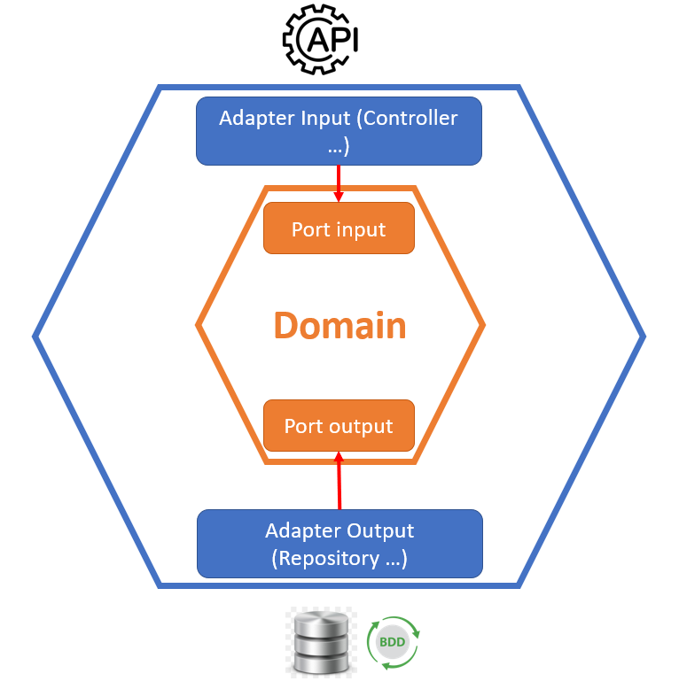
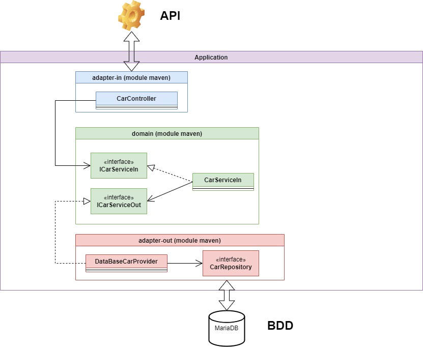

= Architecture Hexagonal en JAVA
FABRE Laurent
v0.1, 20/04/2022: Première version
:toc:
:icons: font

== Version
[horizontal]
Java:: *17*
Spring boot:: *2.6.6*

== Présentation

=== Objectif
L'objectif de ce projet est de montrer une façon de réaliser l'architecture
hexagonale en JAVA

== L'architecture hexagonale

_L'architecture quoi ?_

TIP: L'architecture hexagonale, ou architecture à base de ports et d'adaptateurs, est un patron d'architecture utilisé dans le domaine
de la conception des logiciels.  Elle vise à créer des systèmes à base de composants d'application qui sont faiblement couplés et qui
peuvent être facilement connectés à leur environnement logiciel au moyen de ports et d'adaptateurs. Ces composants sont modulaires et
interchangeables ce qui renforce la cohérence des traitements et facilite l'automatisation des tests. +
Plus d'information https://fr.wikipedia.org/wiki/Architecture_hexagonale_(logiciel)[ici]

=== Les grands principes
*L’architecture hexagonale s’appuie sur trois principes :*

. La séparation explicite de l'*_User-Side_*, du *_Business Logic_* et du *_Server-Side_*.
. Toutes les dépendances vont vers la *_Business Logic_*.
. Les frontières de l'application sont isolées par des *_Ports_* et des *_Adapters_*.

=== Schéma de l'architecture

[.left]

[big underline]*Adapter :* +
*Input :* Les Adapters Input représente la couche application. Il peut s’agir de contrôleur Rest, de service de message etc …
C’est la porte d’entrée de votre application. +
*Output :* Les Adapters Output représente la couche de persistance des données, l’infrastructure.
Que celle-ci soit via un BDD Maria, une MongoDB ou encore des fichiers. C’est la porte de sortie de votre application. +
[big underline]*Domain :* +
Le domaine est l’implémentation de la couche métier. C’est le noyau central de l’application.
On y retrouve toute la logique métier. On trouve aussi les différents ports (interface)
de communication avec les Adapters. Le domaine n’a aucune connaissance des Adapters ce sont
les Adapters qui l’importe. Il doit être complètement dissocié des différents Frameworks de votre
application.
(On peut bien sûr avoir des dépendances faibles avec des petites librairies comme _Apache Commons_.) +
[big underline]*Port :* +
Les ports représentent les interfaces de communication entre le Domain et les Adapters. Ils sont implémentés par les différents Adapters pour pouvoir communiquer avec le Domain.

=== Avantages

. Indépendance de la couche métier aux autres couches. Meilleure séparation du code.
. Les tests sont plus simples à implémenter.
. On peut modifier notre système de persistance ou nos controllers sans nous soucier du domaine.
. Séparation des problèmes. À tout moment, on peut choisir de se concentrer sur une seule logique,
presque indépendamment des deux autres : la logique applicative, la logique métier,
ou la logique infrastructure. On les comprend plus facilement sans les mélanger,
et les contraintes de chaque logique a moins d’impact sur les autres.
. La logique métier est mise en avant.

=== Désavantages

. Nous avons besoin de plus de code qu'une architecture traductionnelle.
. C'est une structure un peu plus complexe.

== Réalisation

Pour cet exemple, nous avons créé un projet Spring boot et utiliser les modules de maven pour
séparer efficacement les différentes couches.

=== Intialisation du projet

 * Pour ce projet, nous utilisons Java en version *17*. Il vous faut donc une JDK adaptée.
 * Pour simuler la BDD mariaDB nous utilisons Docker avec docker-compose. Il vous faut donc installer
docker sur votre PC puis lancer le fichier _docker-compose-local.yml_ qui se trouve dans les
_resources_ du module *_adapter-out_*.

=== Schéma du projet

Dans ce schéma nous pouvons voir clairement l'architecture du projet pour l'entité *_Car_*.

* En [purple]#violet# nous retrouvons notre application qui contient ses 3 principaux modules.
* En [blue]#bleu# nous retrouvons notre module _adapter-in_ qui contient le controller REST de
l'entité Car. Nous voyons que ce controller appel l'interface _ICarServiceIn_ qui se trouve
dans le module _domain_ pour pouvoir donner les instructions au service de celui-ci.
* En [green]#vert# nous retrouvons notre module _domain_ qui contient les deux interfaces
(port) pour communiquer avec les adapters. Nous voyons que le domain n'a pas connaissance
des adapters mais que ce sont les adpaters qui utilisent les interfaces de celui-ci. +
Le domain possède l'implémentation du service _ICarServiceIn_ qui contient toute
la logique métier, en utilisant l'interface _ICarServiceOut_ pour utiliser la persistance
des données.

* En [red]#rouge# nous retrouvons notre module _adapter-out_ qui contient la partie
persistance des données. Nous avons notre provider qui implémente l'interface _ICarServiceOut_
du module domain. Dedans nous aurons la logique de persistance avec l'utilisation
de l'interface JPA _CarRepository_. Lors de l'execution notre service _CarServiceIn_
utilisera donc indirectement cette adapter pour persister ses données.

=== Liens entre les modules maven

image::doc/img/modules_links.jpg[300,300,align="center"]

Les dépendences des différents modules reste simple et respect tout ce qui est dit plus
haut : +

* Le module *_adapter-in_* à pour dependence le module _domain_ (pour pouvoir appeler
l'interface _ICaeServiceIn_ qui est son point d'entré dans la logique métier). Sachant
que ce projet utilise le framework Spring Boot et que nous faisons un controller REST
il lui faudra aussi la dépendance _spring-boot-starter-web_. Nous pouvons retrouver
ici toutes les dependencies nécessaire au partage de nos données (REST, SOAP etc ...).
* Le module* _domain_* n'a aucune dependence. Comme nous nous en doutions.
* Le module *_adapter-out_* à pour dependence le module _domain_ (pour pouvoir implémenter
l'interface _ICaeServiceOut_ et lui donnée la logique de persistance des données).
Comme nous voulons utiliser JPA pour persister nos données il nous faudra aussi la
dépendence _spring-boot-starter-data-jpa_. Nous pouvons retrouver
ici toutes les dependencies nécessaire à la persistance des données (MangoDB, CSV etc ...).

=== Gestion des Beans

Nous n'avons pas encore parlé du dernier module, le module *_core_*. +
Dans celui-ci nous retrouvons le _main_ de l'application ansi que la configuration
de celle-ci.

== Utilisation d'icomoon

Quand vous vous retrouvez sur le site icomoon, une suite d'icône "IcoMoon -Free" vous
sont proposés. Ces icônes sont gratuites et vous pouvez les utiliser directement. +
Si ces icônes ne suffisent pas vous pouvez en importer d'autre.

Il vous suffit ensuite de cliquer sur les icônes que vous souhaitez utiliser. (Ceux sélectionnés ont un contour orange)

image::src/assets/img-doc/icon-selected.png[300,300]

Sélectionner votre mode d’export « Generate SVG / PNG » ou « Generate Font »

image::src/assets/img-doc/format-generated.png[300,800]

Pour ce projet, on a utilisé le format *SVG*.

On arrive sur une page qui récapitule les icônes sélectionnées. +
Il suffit de cliquer sur *_Download_*. +
Un dossier zip nommé "icomonn" sera téléchargé. À l'intérieur, on retrouve un svg nommé
*"symbol-defs.svg"*, ce fichier contient toutes nos icônes. +
Il suffit donc de le copier dans votre projet pour l'utiliser.

== Intialisation du projet

* Lancer la commande suivante pour installer le node_modules.
----
npm i
----
* Lancer la commande pour lancer le projet.
----
ng serve
----
* Accédez à l'url http://localhost:4200/ dans votre navigateur.

== Fonctionnement du projet

Ce projet contient le component *"svg-icon"*, dans sa partie html nous utilisons
la base *_<svg>_* pour afficher un svg à notre IHM. +
Le *_path_* contiendra la référence de notre svg (son chemin + l'id).

[source,html]
----
<svg>
  <use [attr.xlink:href]=this.path></use>
</svg>
----

Plus haut je vous ai parlé d'id pour récupérer notre svg.

Voici quelques explications :  +
Si on ouvre notre fichier "symbol-defs.svg" généré plus haut on peut découvrir
la structure suivante :

[source,xml]
----
<symbol id="icon-home" viewBox="0 0 32 32">
    <path d="..."></path>
</symbol>
<symbol id="icon-home2" viewBox="0 0 32 32">
    <path d="..."></path>
</symbol>
<symbol id="icon-home3" viewBox="0 0 32 32">
    <path d="..."></path>
</symbol>
...
----

Dans ce fichier, chaque *_<symbol></symbol>_* représente une icône. +
Et chaque icône a un id, c'est ce que j'appelle plus haut, l'id du svg. +
Pour pouvoir récupérer notre icône, il suffit donc d'utiliser le chemin suivant
comme path pour notre composant *svg-icon* :
****
assets/icons/symbol-defs.svg#icon-id
****

[horizontal]

assets/icons/symbol-defs.svg:: correspond au chemin du fichier.
#icon-id:: correspond à l'id du svg.

Exemple :

****
assets/icons/symbol-defs.svg#icon-home
****

Pour afficher l'icône home.

=== Utilisation du composant

Pour utiliser le composant rien de plus simple, dans votre page html il suffit d'appeler le composant
et lui donner l'id de l'icône que vous voulez afficher.

[source,html]
----
<svg-icon icon="icon-home"></svg-icon>
----

Et voilà ! Vous trouverez sur votre page, le magnifique icône "icon-home".

image::src/assets/img-doc/result.png[300,300]

== Conclusion

On arrive à la fin de la présentation de ce projet. +
Vous avez pu voir l'utilité des sprites SVG.

N'hésitez pas à me contacter pour toute remarque ou proposition d'évolution.
Bon dev à tous !
